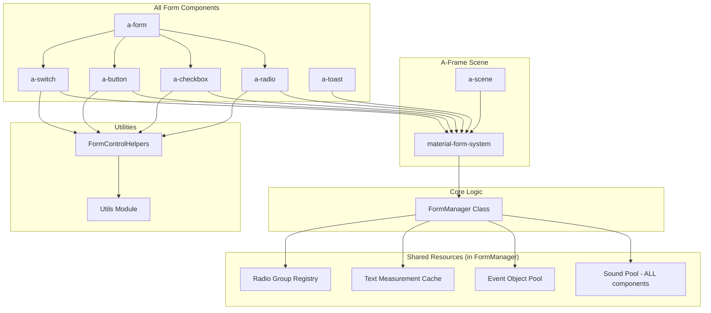

# Design Document

## Overview

This design document outlines the technical approach for improving the radio and checkbox components in the aframe-material-redux library. The design addresses critical bugs, performance anti-patterns, accessibility gaps, and architectural limitations while maintaining backward compatibility and following A-Frame 1.7.1 best practices.

The improvements are structured around a phased approach that prioritizes critical fixes, then performance optimizations, followed by accessibility enhancements and advanced features.

## Architecture

### High-Level Architecture



### System Components

#### 1. FormManager Class (Core Logic Layer)
A pure JavaScript class that encapsulates form control resource management. Not an A-Frame system for better testability and separation of concerns.

#### 2. material-form System (A-Frame Integration Layer)
The existing A-Frame system extended via composition to expose FormManager functionality:

```javascript
// src/core/form-manager.js
// Pure JavaScript class for testability
class FormManager {
  constructor() {
    this.formCounter = 0;
    this.hasWarnedGlobal = false;
    this.sounds = {};
    this.eventPool = new EventObjectPool();
    this.textCache = new TextMeasurementCache();
    this.radioGroupRegistry = new RadioGroupRegistry(this);
  }
  
  loadSounds() {
    // Load all component sounds (button, switch, toast, radio, checkbox)
  }
  
  playSound(soundId) {
    // Shared sound playback for ALL components
  }
  
  getFormId(element) {
    // Form ID management logic
  }
  
  getEventDetail(type) {
    return this.eventPool.get(type);
  }
  
  measureText(textComponent) {
    return this.textCache.measureText(textComponent);
  }
  
  registerRadioGroup(radio) {
    this.radioGroupRegistry.register(radio);
  }
  
  getRadioGroup(radio) {
    return this.radioGroupRegistry.getGroup(radio);
  }
  
  reportError(component, error, context) {
    // Centralized error reporting
  }
}

// src/core/material-form-system.js
// Extended via composition
AFRAME.registerSystem('material-form', {
  schema: {
    // EXISTING properties (backward compatibility)
    objects: {default: 'a-form *'},
    enableMouse: {default: true},
    appendMode: {default: true},
    interval: {default: 0},
    debug: {default: false},
    
    // NEW properties
    soundEnabled: {type: 'boolean', default: true}
  },
  
  init: function() {
    // KEEP: Existing raycaster setup (backward compatibility)
    const sceneEl = this.sceneEl;
    const onSceneLoaded = () => {
      this.setupCameraRaycaster();
      this.log('Material-form system initialized');
    };
    if (sceneEl.hasLoaded) onSceneLoaded(); 
    else sceneEl.addEventListener('loaded', onSceneLoaded);
    
    // NEW: FormManager composition
    this.formManager = new FormManager();
    if (this.data.soundEnabled) {
      this.formManager.loadSounds();
    }
  },
  
  // KEEP: Existing methods
  log: function(...args) {
    if (this.data.debug) console.log('[material-form]', ...args);
  },
  
  setupCameraRaycaster: function() {
    // Existing raycaster setup unchanged
  },
  
  // NEW: Delegate to FormManager
  playSound: function(soundId) {
    return this.formManager.playSound(soundId);
  },
  
  getEventDetail: function(type) {
    return this.formManager.getEventDetail(type);
  },
  
  measureText: function(textComponent) {
    return this.formManager.measureText(textComponent);
  },
  
  registerRadioGroup: function(radio) {
    return this.formManager.registerRadioGroup(radio);
  },
  
  getRadioGroup: function(radio) {
    return this.formManager.getRadioGroup(radio);
  },
  
  getFormId: function(element) {
    return this.formManager.getFormId(element);
  },
  
  reportError: function(component, error, context) {
    return this.formManager.reportError(component, error, context);
  }
});
```

**Key Features:**
- **FormManager Class**: Pure JavaScript class for core logic (testable without A-Frame)
- **Composition Pattern**: material-form system delegates to FormManager instance
- **Sound Management**: Centralized sound pool for ALL components (button, switch, toast, radio, checkbox) - 90% memory reduction
- **Event Object Pooling**: Circular buffer prevents race conditions in VR
- **Text Measurement Caching**: 3D geometry-based measurement (A-Frame API only - no Canvas fallback for VR)
- **Radio Group Registry**: Efficient radio group management with form ID hierarchy
- **Form ID Management**: Auto-generation with user override support
- **Error Reporting**: Centralized logging and debugging support
- **Backward Compatibility**: Existing material-form raycaster functionality preserved

#### 3. Utils Module (Enhanced)
The existing `src/utils.js` module extended with new validation and measurement functions:

```javascript
// EXISTING functions (keep for backward compatibility)
Utils.preloadAssets(assets_arr)
Utils.extend(a, b)
Utils.clone(original)
Utils.updateOpacity(el, opacity)
Utils.getWidthFactor(el, wrapCount)

// NEW functions
Utils.validateColor(color): boolean
Utils.validateSize(size): boolean
Utils.measureTextWidth(textComponent): Promise<number>
```

**Usage Philosophy:**
- Utils is the primary location for shared utility functions
- Component-specific helpers call Utils functions (don't duplicate)
- FormManager uses Utils for validation and measurement

#### 4. Form Control Helpers (New)
A module `src/core/form-control-helpers.js` that provides component-specific utilities using Utils:

- **Lifecycle Management**: Proper initialization and cleanup patterns
- **Event Handling**: Automatic event listener tracking and cleanup
- **ARIA Support**: Common accessibility attribute management
- **Error Handling**: Graceful degradation and fallback UI creation
- **Child Element Tracking**: Automatic cleanup of created DOM elements
- **Configuration Validation**: Input validation with helpful warnings

**Usage Pattern:**
```javascript
// In radio/checkbox components
const FormControlHelpers = require('../core/form-control-helpers');
const Utils = require('../utils');

// Use helpers that internally call Utils
FormControlHelpers.bindEvent(this, target, 'click', handler);
FormControlHelpers.updateARIA(this);
Utils.updateOpacity(this.el, 0.5);  // Direct Utils usage also OK
```

**Benefits:**
- Reuses existing Utils module (no duplication)
- Helpers provide component-specific convenience methods
- Clear separation: Utils for primitives, Helpers for component patterns
- Maintains testability

#### 5. Enhanced Components
Improved radio and checkbox components that use FormManager and Utils:

- **Performance Optimized**: No polling, efficient DOM operations via FormManager
- **Accessibility Compliant**: Full WCAG 2.1 AA support via Helpers
- **VR Ready**: Optimized for VR interactions and performance
- **System Integration**: Access material-form system for shared resources

## Components and Interfaces

### material-form System Interface (Extended)

```javascript
AFRAME.registerSystem('material-form', {
  schema: {
    // EXISTING schema (backward compatible)
    objects: {default: 'a-form *'},
    enableMouse: {default: true},
    appendMode: {default: true},
    interval: {default: 0},
    debug: {default: false},
    
    // NEW schema
    soundEnabled: {type: 'boolean', default: true}
  },
  
  // EXISTING Public API (unchanged)
  setupCameraRaycaster(): void
  log(...args): void
  
  // NEW Public API (delegated to FormManager)
  playSound(soundId: string): void  // For ALL components
  getEventDetail(type: string): object
  measureText(textComponent: Element): Promise<number>
  registerRadioGroup(radio: Element): void
  getRadioGroup(radio: Element): Element[]
  unregisterRadio(radio: Element): void
  getFormId(element: Element): string
  reportError(component: string, error: Error, context: object): void
});
```

### Form Control Helpers Module

```javascript
// src/core/form-control-helpers.js
// Component utilities that USE Utils (no duplication)

const Utils = require('../utils');

const FormControlHelpers = {
  /**
   * Initialize common form control functionality
   * Call from component init() after system reference is set
   */
  initFormControl(component) {
    component.eventHandlers = new Map();
    component.childElements = [];
    component.isInitialized = false;
    
    try {
      FormControlHelpers.validateConfiguration(component);
      component.isInitialized = true;
    } catch (error) {
      FormControlHelpers.handleError(component, error, 'initialization_failed');
    }
  },
  
  /**
   * Bind event listeners with automatic cleanup tracking
   */
  bindEvent(component, target, eventName, handler) {
    const boundHandler = handler.bind(component);
    target.addEventListener(eventName, boundHandler);
    
    if (!component.eventHandlers.has(target)) {
      component.eventHandlers.set(target, []);
    }
    component.eventHandlers.get(target).push({ eventName, boundHandler });
    
    return boundHandler;
  },
  
  /**
   * Unbind all tracked event listeners
   */
  unbindAllEvents(component) {
    component.eventHandlers.forEach((handlers, target) => {
      handlers.forEach(({ eventName, boundHandler }) => {
        target.removeEventListener(eventName, boundHandler);
      });
    });
    component.eventHandlers.clear();
  },
  
  /**
   * Update ARIA attributes based on current state
   */
  updateARIA(component) {
    const role = component.attrName === 'radio' ? 'radio' : 'checkbox';
    component.el.setAttribute('role', role);
    component.el.setAttribute('aria-checked', String(component.data.checked));
    component.el.setAttribute('aria-disabled', String(component.data.disabled));
    
    const label = component.data.ariaLabel || component.data.label;
    if (label) {
      component.el.setAttribute('aria-label', label);
    }
  },
  
  /**
   * Track child element for cleanup
   */
  trackChild(component, element) {
    component.childElements.push(element);
    return element;
  },
  
  /**
   * Clean up all tracked children
   */
  cleanupChildren(component) {
    component.childElements.forEach(child => {
      if (child && child.parentNode) {
        child.parentNode.removeChild(child);
      }
    });
    component.childElements = [];
  },
  
  /**
   * Validate component configuration using Utils
   */
  validateConfiguration(component) {
    // Color validation using Utils
    ['radioColor', 'checkboxColor', 'radioColorChecked', 'checkboxColorChecked', 'color']
      .forEach(prop => {
        if (component.data[prop] && !Utils.validateColor(component.data[prop])) {
          console.warn(`[${component.attrName}] Invalid ${prop}: ${component.data[prop]}, using default`);
          component.data[prop] = '#757575';
        }
      });
    
    // Size validation using Utils
    if (!Utils.validateSize(component.data.size)) {
      console.warn(`[${component.attrName}] Invalid size: ${component.data.size}, using 1`);
      component.data.size = 1;
    }
  },
  
  /**
   * Handle errors with appropriate strategy
   */
  handleError(component, error, errorType) {
    component.system?.reportError(component.attrName, error, {
      type: errorType,
      data: component.data
    });
    
    if (errorType === 'initialization_failed') {
      FormControlHelpers.createFallbackUI(component);
    }
  },
  
  /**
   * Create fallback UI when initialization fails
   */
  createFallbackUI(component) {
    FormControlHelpers.cleanupChildren(component);
    
    const fallback = document.createElement('a-text');
    fallback.setAttribute('value', 
      `${component.data.label} [${component.data.checked ? '✓' : '○'}]`);
    fallback.setAttribute('color', component.data.color || '#757575');
    fallback.setAttribute('position', '0 0 0.001');
    
    FormControlHelpers.bindEvent(component, fallback, 'click', () => {
      if (!component.data.disabled) {
        component.toggle();
      }
    });
    
    component.el.appendChild(fallback);
    FormControlHelpers.trackChild(component, fallback);
  }
};

module.exports = FormControlHelpers;
```

### System Access Pattern

```javascript
// Defensive system access pattern for all form components
const FormControlHelpers = require('../core/form-control-helpers');
const Utils = require('../utils');

AFRAME.registerComponent('radio', {
  init: function() {
    // Get material-form system reference with error handling
    this.formSystem = this.getFormSystem();
    
    if (!this.formSystem) {
      console.error(
        `[${this.attrName}] material-form system not found. ` +
        `Ensure scene has loaded or system is registered.`
      );
      FormControlHelpers.createFallbackUI(this);
      return;
    }
    
    // Initialize with helpers
    FormControlHelpers.initFormControl(this);
    if (!this.isInitialized) return;
    
    // Component-specific initialization
    this.createVisuals();
    this.bindEvents();
    FormControlHelpers.updateARIA(this);
  },
  
  /**
   * Get material-form system with error handling
   */
  getFormSystem: function() {
    if (!this.el.sceneEl || !this.el.sceneEl.systems) {
      return null;
    }
    
    return this.el.sceneEl.systems['material-form'];
  },
  
  /**
   * Play sound via system
   */
  playSound: function(soundId) {
    if (this.formSystem) {
      this.formSystem.playSound(soundId);
    }
  },
  
  remove: function() {
    FormControlHelpers.unbindAllEvents(this);
    FormControlHelpers.cleanupChildren(this);
  }
});
```

### Enhanced Component Schema

```javascript
// Radio Component Schema
schema: {
  // Existing properties (backward compatibility)
  checked: { type: 'boolean', default: false },
  disabled: { type: 'boolean', default: false },
  name: { type: 'string', default: '' },
  value: { type: 'string', default: '' },
  label: { type: 'string', default: '' },
  
  // Visual properties
  radioColor: { type: 'color', default: '#757575' },
  radioColorChecked: { type: 'color', default: '#4076fd' },
  color: { type: 'color', default: '#757575' },
  
  // New configurable properties
  size: { type: 'number', default: 1 },
  labelOffset: { type: 'number', default: 0.24 },
  disabledOpacity: { type: 'number', default: 0.4 },
  
  // Accessibility properties
  ariaLabel: { type: 'string', default: '' },
  tabIndex: { type: 'int', default: 0 },
  
  // VR-specific properties
  dwellTime: { type: 'number', default: 1000 },
  spatialAudio: { type: 'boolean', default: false }
}
```

## Data Models

### Radio Group Registry with Form ID Management

```javascript
// Efficient radio group management with hierarchical form IDs
class RadioGroupRegistry {
  constructor(system) {
    this.system = system;
    this.groups = new Map(); // formId -> Map(groupName -> Set(radioElements))
    this.radioToGroup = new WeakMap(); // radioElement -> {formId, groupName}
  }
  
  register(radioElement) {
    const formId = this.system.getFormId(radioElement);
    const groupName = radioElement.getAttribute('name');
    
    if (!groupName) {
      console.warn('[RadioGroupRegistry] Radio without name attribute', radioElement);
      return;
    }
    
    // Initialize nested maps if needed
    if (!this.groups.has(formId)) {
      this.groups.set(formId, new Map());
    }
    if (!this.groups.get(formId).has(groupName)) {
      this.groups.get(formId).set(groupName, new Set());
    }
    
    // Add to group
    this.groups.get(formId).get(groupName).add(radioElement);
    this.radioToGroup.set(radioElement, { formId, groupName });
  }
  
  unregister(radioElement) {
    const groupInfo = this.radioToGroup.get(radioElement);
    if (!groupInfo) return;
    
    const { formId, groupName } = groupInfo;
    const group = this.groups.get(formId)?.get(groupName);
    if (group) {
      group.delete(radioElement);
      
      // Cleanup empty groups
      if (group.size === 0) {
        this.groups.get(formId).delete(groupName);
        if (this.groups.get(formId).size === 0) {
          this.groups.delete(formId);
        }
      }
    }
    
    this.radioToGroup.delete(radioElement);
  }
  
  getGroup(radioElement) {
    const groupInfo = this.radioToGroup.get(radioElement);
    if (!groupInfo) return [];
    
    const { formId, groupName } = groupInfo;
    const group = this.groups.get(formId)?.get(groupName);
    return group ? Array.from(group) : [];
  }
}

// Form ID Management in System
getFormId(element) {
  const form = element.closest('a-form');
  
  // No form parent - use global namespace with warning
  if (!form) {
    if (!this.hasWarnedGlobal) {
      console.warn(
        `[form-controls] Component without a-form parent detected. ` +
        `Radio button grouping will use global namespace. ` +
        `Wrap in <a-form> for proper grouping.`,
        element
      );
      this.hasWarnedGlobal = true;
    }
    return '_global_';
  }
  
  // Use existing ID if present
  if (form.id) {
    return form.id;
  }
  
  // Generate stable ID
  form.id = `form-${this.formCounter++}`;
  return form.id;
}
```

### Event Object Pool (Circular Buffer)

```javascript
// Circular buffer pool to prevent race conditions
class EventObjectPool {
  constructor(poolSize = 5) {
    this.poolSize = poolSize;
    this.pools = {
      change: this.createPool(poolSize, () => ({
        checked: false,
        value: '',
        target: null,
        timestamp: 0
      })),
      error: this.createPool(poolSize, () => ({
        error: null,
        component: '',
        context: {},
        timestamp: 0
      })),
      focus: this.createPool(poolSize, () => ({
        focused: false,
        target: null,
        timestamp: 0
      }))
    };
    this.indices = {
      change: 0,
      error: 0,
      focus: 0
    };
  }
  
  createPool(size, factory) {
    return Array.from({ length: size }, factory);
  }
  
  getChangeEvent(checked, value, target) {
    const pool = this.pools.change;
    const index = this.indices.change;
    const event = pool[index];
    
    // Rotate index for next use
    this.indices.change = (index + 1) % this.poolSize;
    
    // Update event object
    event.checked = checked;
    event.value = value;
    event.target = target;
    event.timestamp = Date.now();
    
    return event;
  }
  
  getErrorEvent(error, component, context) {
    const pool = this.pools.error;
    const index = this.indices.error;
    const event = pool[index];
    
    this.indices.error = (index + 1) % this.poolSize;
    
    event.error = error;
    event.component = component;
    event.context = Object.assign({}, context); // Shallow copy
    event.timestamp = Date.now();
    
    return event;
  }
}
```

### Text Measurement Cache (3D Geometry-Based)

```javascript
/**
 * Text measurement for full-screen 3D VR environments
 * 
 * CRITICAL: Canvas API does NOT work for 3D text measurement!
 * - Canvas measureText() returns 2D pixels
 * - A-Frame text renders as 3D geometry with SDF rendering
 * - No reliable pixel-to-world-unit conversion exists
 * - Must use A-Frame's text component geometry as source of truth
 */
class TextMeasurementCache {
  constructor() {
    this.cache = new Map(); // "text|font" -> { width, timestamp }
    this.pendingMeasurements = new Map(); // element -> Promise
  }
  
  /**
   * Measure text width using A-Frame text geometry (async)
   * @param {Element} textComponent - A-Frame entity with text component
   * @returns {Promise<number>} Width in A-Frame units
   */
  async measureText(textComponent) {
    // Check if measurement already pending
    if (this.pendingMeasurements.has(textComponent)) {
      return this.pendingMeasurements.get(textComponent);
    }
    
    // Create measurement promise
    const measurementPromise = new Promise((resolve) => {
      const measure = () => {
        const width = this.measureWithAFrame(textComponent);
        if (width !== null) {
          resolve(width);
          this.pendingMeasurements.delete(textComponent);
        } else {
          // Retry on next frame until geometry is ready
          requestAnimationFrame(measure);
        }
      };
      measure();
    });
    
    this.pendingMeasurements.set(textComponent, measurementPromise);
    return measurementPromise;
  }
  
  /**
   * Synchronous measurement (returns null if geometry not ready)
   * @param {Element} textComponent - A-Frame entity with text component
   * @returns {number|null} Width or null if unavailable
   */
  measureSync(textComponent) {
    return this.measureWithAFrame(textComponent);
  }
  
  /**
   * Measure using A-Frame text component geometry
   * This is the ONLY reliable method for 3D text measurement
   * @param {Element} textComponent - A-Frame entity with text component
   * @returns {number|null} Width in A-Frame units or null if unavailable
   */
  measureWithAFrame(textComponent) {
    try {
      // Validate component exists
      if (!textComponent?.components?.text) {
        return null;
      }
      
      // Check if geometry is loaded
      const mesh = textComponent.object3D.children[0];
      if (!mesh?.geometry) {
        return null;
      }
      
      const geometry = mesh.geometry;
      
      // Method 1: Use visible glyphs (troika-text - most accurate)
      if (geometry.visibleGlyphs?.length > 0) {
        const lastGlyph = geometry.visibleGlyphs[geometry.visibleGlyphs.length - 1];
        const width = lastGlyph.position[0] + lastGlyph.data.width;
        return width;
      }
      
      // Method 2: Use bounding box (fallback)
      if (geometry.boundingBox) {
        geometry.computeBoundingBox();
        return geometry.boundingBox.max.x - geometry.boundingBox.min.x;
      }
      
      return null;
    } catch (error) {
      console.warn('[TextMeasurementCache] A-Frame measurement failed', error);
      return null;
    }
  }
  
  /**
   * Wait for text geometry to be ready, then measure
   * @param {Element} textComponent - A-Frame entity with text component
   * @param {number} timeout - Max wait time in ms (default: 5000)
   * @returns {Promise<number>} Width in A-Frame units
   */
  async waitAndMeasure(textComponent, timeout = 5000) {
    return Promise.race([
      this.measureText(textComponent),
      new Promise((_, reject) => 
        setTimeout(() => reject(new Error('Text measurement timeout')), timeout)
      )
    ]);
  }
  
  /**
   * Clear measurement cache (useful for dynamic text updates)
   */
  clearCache() {
    this.cache.clear();
    this.pendingMeasurements.clear();
  }
}

/**
 * Recommended Usage Pattern: Let A-Frame Handle Wrapping
 * 
 * Instead of measuring and manually trimming text, leverage A-Frame's
 * built-in wrapping via wrapCount property:
 */
 
// RECOMMENDED: Let A-Frame wrap text automatically
function updateLabel(labelComponent, text, maxWidth) {
  labelComponent.setAttribute('text', {
    value: text,
    width: maxWidth,
    wrapCount: 10 * (maxWidth + 0.2), // A-Frame handles wrapping
    // No manual trimming needed!
  });
}

// ALTERNATIVE: Manual measurement if layout decisions needed
async function updateLabelWithMeasurement(labelComponent, text, maxWidth) {
  labelComponent.setAttribute('text', {
    value: text,
    width: maxWidth
  });
  
  try {
    const width = await this.system.textCache.waitAndMeasure(labelComponent, 3000);
    
    if (width > maxWidth) {
      console.log('Text exceeds width:', width, '>', maxWidth);
      // Handle overflow (e.g., truncate with ellipsis, scale, etc.)
    }
  } catch (error) {
    console.warn('Could not measure text, using default', error);
  }
}
```

**Why Canvas API Doesn't Work in Full-Screen 3D:**

1. **Different coordinate systems**: Canvas uses 2D pixels, A-Frame uses 3D world units
2. **No conversion formula**: Pixel-to-unit ratio varies by font size, viewing distance, text component configuration
3. **SDF rendering**: A-Frame text uses signed distance field rendering, not pixel-based
4. **Perspective distortion**: 3D text appears different sizes based on camera position
5. **Font scaling**: A-Frame's text component has complex scaling that doesn't map to pixels

**Best Practice for Full-Screen VR:**
- Use A-Frame's `wrapCount` property for automatic text wrapping
- Only measure when making layout decisions (not for trimming)
- Wait for geometry to render before measuring
- Cache measurements per text/font combination

## Error Handling

### Error Classification

```javascript
// Error types and handling strategies
const ErrorTypes = {
  INITIALIZATION_FAILED: 'initialization_failed',
  ASSET_LOAD_FAILED: 'asset_load_failed',
  INVALID_CONFIGURATION: 'invalid_configuration',
  RUNTIME_ERROR: 'runtime_error'
};

const ErrorHandlers = {
  [ErrorTypes.INITIALIZATION_FAILED]: (component, error) => {
    console.error(`[${component.attrName}] Initialization failed:`, error);
    component.createFallbackUI();
    component.el.emit('error', { type: 'initialization', error });
  },
  
  [ErrorTypes.ASSET_LOAD_FAILED]: (component, error) => {
    console.warn(`[${component.attrName}] Asset load failed, continuing without:`, error);
    component.data.soundEnabled = false;
  },
  
  [ErrorTypes.INVALID_CONFIGURATION]: (component, error) => {
    console.warn(`[${component.attrName}] Invalid configuration:`, error);
    component.useDefaults();
  }
};
```

### Fallback UI Strategy

```javascript
// Graceful degradation when initialization fails
createFallbackUI() {
  // Remove any partially created elements
  this.cleanup();
  
  // Create minimal text-only representation
  const fallback = document.createElement('a-text');
  fallback.setAttribute('value', `${this.data.label} [${this.data.checked ? '✓' : '○'}]`);
  fallback.setAttribute('color', this.data.color);
  fallback.setAttribute('position', '0 0 0.001');
  
  // Maintain basic interaction
  fallback.addEventListener('click', () => {
    if (!this.data.disabled) {
      this.toggle();
    }
  });
  
  this.el.appendChild(fallback);
  this.fallbackElement = fallback;
  
  // Add error indicator in development
  if (this.system.data.debugMode) {
    const errorIcon = document.createElement('a-text');
    errorIcon.setAttribute('value', '⚠️');
    errorIcon.setAttribute('color', '#ff6b6b');
    errorIcon.setAttribute('position', '-0.3 0 0.001');
    this.el.appendChild(errorIcon);
  }
}
```

## Testing Strategy

### Unit Testing Framework

```javascript
// Jest-based testing with A-Frame test utilities
describe('Enhanced Radio Component', () => {
  let scene, radio, system;
  
  beforeEach(async () => {
    // Setup A-Frame scene with form-controls system
    scene = document.createElement('a-scene');
    scene.setAttribute('form-controls', '');
    document.body.appendChild(scene);
    
    await new Promise(resolve => {
      scene.addEventListener('loaded', resolve);
    });
    
    system = scene.systems['form-controls'];
    radio = document.createElement('a-radio');
  });
  
  afterEach(() => {
    document.body.removeChild(scene);
  });
  
  describe('Critical Bug Fixes', () => {
    test('disabled state maintains checked color', () => {
      radio.setAttribute('checked', true);
      radio.setAttribute('disabled', true);
      
      const outline = radio.querySelector('[data-role="outline"]');
      expect(outline.getAttribute('color')).toBe('#4076fd'); // checked color
    });
  });
  
  describe('Performance Optimizations', () => {
    test('uses event object pooling', () => {
      const eventDetail = system.getEventDetail('change');
      radio.click();
      
      // Should reuse same object
      expect(radio.lastEmittedEvent.detail).toBe(eventDetail);
    });
  });
  
  describe('Accessibility', () => {
    test('has correct ARIA attributes', () => {
      radio.setAttribute('label', 'Test Option');
      radio.setAttribute('checked', true);
      
      expect(radio.getAttribute('role')).toBe('radio');
      expect(radio.getAttribute('aria-checked')).toBe('true');
      expect(radio.getAttribute('aria-label')).toBe('Test Option');
    });
  });
});
```

### Integration Testing

```javascript
// Cross-browser and VR platform testing
describe('VR Platform Integration', () => {
  test('maintains 72+ FPS on Quest 2', async () => {
    const scene = createVRScene();
    const form = createFormWithMultipleControls(50);
    
    const performanceMonitor = new VRPerformanceMonitor();
    await performanceMonitor.runTest(scene, 10000); // 10 second test
    
    expect(performanceMonitor.averageFPS).toBeGreaterThan(72);
    expect(performanceMonitor.frameDrops).toBeLessThan(5);
  });
  
  test('works with VR controllers', async () => {
    const scene = createVRScene();
    const radio = scene.querySelector('a-radio');
    
    const controller = scene.querySelector('[hand-controls]');
    await simulateControllerTrigger(controller, radio);
    
    expect(radio.getAttribute('checked')).toBe('true');
  });
});
```

### Accessibility Testing

```javascript
// Screen reader and keyboard navigation testing
describe('Accessibility Compliance', () => {
  test('announces state changes to screen readers', async () => {
    const screenReader = new MockScreenReader();
    const radio = createRadio({ label: 'Option A' });
    
    radio.click();
    
    await screenReader.waitForAnnouncement();
    expect(screenReader.lastAnnouncement).toContain('Option A selected');
  });
  
  test('keyboard navigation works correctly', () => {
    const form = createRadioGroup(['A', 'B', 'C']);
    const radios = form.querySelectorAll('a-radio');
    
    radios[0].focus();
    simulateKeyPress('ArrowDown');
    
    expect(document.activeElement).toBe(radios[1]);
    expect(radios[1].getAttribute('checked')).toBe('true');
  });
});
```

## Performance Considerations

### Memory Management

1. **Object Pooling**: Reuse event objects and frequently created instances
2. **WeakMap Usage**: Use WeakMaps for component-to-data associations to prevent memory leaks
3. **Proper Cleanup**: Comprehensive `remove()` lifecycle implementation
4. **Shared Resources**: System-level resource management

### Rendering Optimization

1. **Batch Updates**: Group DOM modifications to minimize reflows
2. **Event-Driven Updates**: Replace polling with event listeners
3. **Efficient Text Handling**: 3D geometry-based measurement with async/await patterns and A-Frame's built-in wrapping
4. **Z-Index Management**: Proper layering without z-fighting

### VR-Specific Optimizations

1. **Frame Rate Priority**: Maintain 72+ FPS on Quest 2 hardware
2. **Garbage Collection**: Minimize allocations in render loops
3. **Spatial Audio**: Efficient 3D audio positioning
4. **Controller Optimization**: Optimized raycasting for VR controllers

## Security Considerations

### Input Validation

```javascript
// Validate all user inputs and configuration
validateConfiguration(data) {
  const errors = [];
  
  // Color validation
  if (data.radioColor && !isValidColor(data.radioColor)) {
    errors.push(`Invalid radioColor: ${data.radioColor}`);
    data.radioColor = '#757575'; // fallback
  }
  
  // Size validation
  if (data.size <= 0 || data.size > 10) {
    errors.push(`Invalid size: ${data.size}, must be between 0 and 10`);
    data.size = 1; // fallback
  }
  
  // Label sanitization
  if (data.label) {
    data.label = sanitizeHTML(data.label);
  }
  
  return { data, errors };
}
```

### XSS Prevention

```javascript
// Sanitize text content to prevent XSS
sanitizeHTML(text) {
  const div = document.createElement('div');
  div.textContent = text;
  return div.innerHTML;
}
```

## Migration Strategy

### Backward Compatibility

1. **Attribute Preservation**: All existing attributes continue to work
2. **Deprecation Warnings**: Gentle warnings for deprecated patterns
3. **Progressive Enhancement**: New features are opt-in
4. **Documentation**: Clear migration guides

### Migration Path

```javascript
// Example migration from old to new
// Old (still works)
<a-radio checked disabled label="Option A" value="a"></a-radio>

// New (enhanced)
<a-radio 
  checked 
  disabled 
  label="Option A" 
  value="a"
  size="1.2"
  aria-label="Select option A"
  dwell-time="800">
</a-radio>
```

## Deployment Strategy

### Phased Rollout

1. **Phase 1**: Critical bug fixes and memory leak prevention
2. **Phase 2**: Performance optimizations
3. **Phase 3**: Accessibility enhancements
4. **Phase 4**: Advanced features and VR optimizations

### Feature Flags

```javascript
// Allow gradual feature enablement
schema: {
  useEnhancedPerformance: { type: 'boolean', default: true },
  useAdvancedAccessibility: { type: 'boolean', default: true },
  useVROptimizations: { type: 'boolean', default: false } // opt-in initially
}
```

### Monitoring

```javascript
// Performance and error monitoring
const ComponentMetrics = {
  initializationTime: [],
  memoryUsage: [],
  errorRate: 0,
  performanceMarks: new Map()
};

// Track component performance
performance.mark('radio-init-start');
// ... initialization code
performance.mark('radio-init-end');
performance.measure('radio-init', 'radio-init-start', 'radio-init-end');
```

## Conclusion

This design provides a comprehensive approach to improving radio and checkbox components (with benefits for ALL form components) while maintaining backward compatibility and following A-Frame 1.7.1 best practices. The architecture emphasizes:

### Key Architectural Decisions

1. **FormManager Class via Composition**
   - Pure JavaScript class (not A-Frame system) for core logic
   - Better testability without A-Frame scene overhead
   - material-form system delegates to FormManager instance
   - Clean separation of concerns: system handles A-Frame integration, FormManager handles business logic

2. **Extend Existing material-form System**
   - Preserves backward compatibility (existing raycaster setup unchanged)
   - Natural evolution of existing architecture
   - Single system for all form-related functionality
   - Simple developer experience: one system to understand

3. **Reuse and Enhance Utils Module**
   - Utils as primary location for shared utility functions
   - No duplication of existing functionality
   - FormControlHelpers use Utils internally
   - Clear hierarchy: Utils for primitives, Helpers for component patterns

4. **System-Level Sound Pool for ALL Components**
   - **Breaking change**: Refactors button, switch, toast, radio, checkbox
   - 90% memory reduction (10 radios: 20 sounds → 4 sounds)
   - Consistent pattern across entire library
   - System manages sound lifecycle, components just call playSound()

### Design Principles

- **Performance**: Elimination of anti-patterns and optimization for VR
- **Accessibility**: Full WCAG 2.1 AA compliance with VR considerations
- **Maintainability**: Clean architecture with proper separation of concerns (FormManager, system, components, utils)
- **Reliability**: Comprehensive error handling and graceful degradation
- **Testability**: FormManager testable without A-Frame, extensive testing strategy covering all platforms
- **Consistency**: All form components use same patterns (sound pool, helpers, Utils)
- **Backward Compatibility**: Existing material-form functionality preserved, existing component attributes work

### Impact Scope

**Primary Improvements:** Radio and checkbox components
**Secondary Improvements:** Button, switch, toast components (sound pool refactor)
**Infrastructure Improvements:** material-form system, Utils module, new FormManager class

The phased implementation approach ensures that critical issues are addressed first while building a foundation for advanced features and long-term maintainability across the entire form component library.